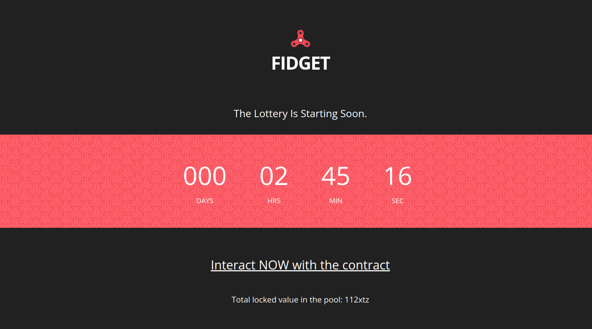
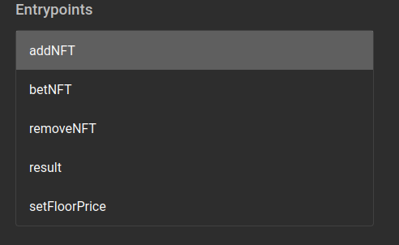

# NFTcroissant

## A NFT lottery.

Deposit NFTs, try to win the jackpot.

Your % to win is proportional to the value of what you deposit!

Deposit what you don't want, win what you crave.

## Technical aspects

addNFT and removeNFT add/remove to the whitelist which NFT collections can be used.

setFloorPrice is for now our way to set for each collection the floor price.

betNFT allows you to deposit your NFT in the lottery, and maybe win the jackpot.

result is called at the end, it'd pick a random number and send all the NFTs to the winner. For now, the random number is choosen by use, in the future we'll use that to make sure we (and no one) can't cheat https://hackmd.io/@Zergity/UnbiasableRNG?type=view

## Where the code is

The code is in "hack.jsligo".

We use a slightly modified version of the FA2 standard which is in the file nftsmartpy.

## How to deploy it

`ligo compile contract hack.jsligo > hack.tz`

`tezos-client originate contract hackContract transferring 0 from alice running hack.tz --init '(Pair (Pair (Pair {} {}) {} 0) {})' --burn-cap 1 --force`